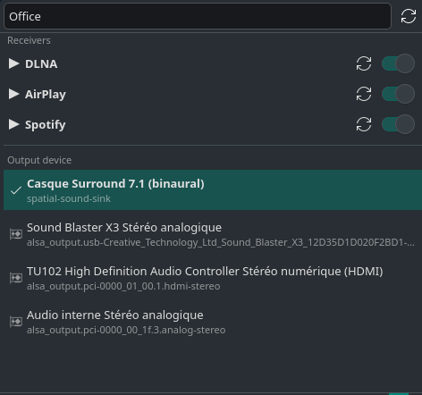
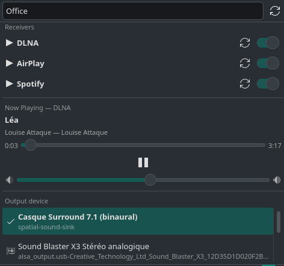

# Bureau Receivers — Applet Plasma KDE

***[English](README.md)** · Français*

Un applet Plasma 6 qui transforme votre machine Linux en **récepteur audio
multi-protocole** — DLNA, AirPlay et Spotify Connect — avec changement de
périphérique de sortie en direct, contrôles de lecture et historique des pistes.

<p align="center">
  
</p>

<p align="center">
  
  
</p>

## Ce qu'il fait

- **Reçoit l'audio de trois protocoles** :
  - **DLNA** via [`gmediarender`][gmr] — depuis Synology Audio Station, DS audio, BubbleUPnP, etc.
  - **AirPlay** via [`shairport-sync`][sps] — depuis iPhone, iPad, Mac
  - **Spotify Connect** via [`librespot`][lrs] — depuis l'application Spotify sur n'importe quel appareil
- **Change le périphérique de sortie en direct** — cliquez sur un périphérique
  dans l'applet, le flux actif est déplacé vers le nouveau sink avec
  `pactl move-sink-input`. Pas de redémarrage, pas de coupure.
- **Contrôles de lecture** dans l'applet :
  - Lecture en cours : titre, artiste, album
  - Timeline avec position/durée (seek pour DLNA)
  - Play/pause (DLNA via UPnP SOAP)
  - Curseur de volume (tous les protocoles, via PulseAudio)
- **Gestion des récepteurs** : interrupteurs on/off, boutons de redémarrage,
  nom éditable (un seul nom met à jour les trois avec suffixes de protocole)
- **Historique des pistes** : chaque piste est enregistrée dans
  `~/.config/bureau-receivers/history.tsv` avec horodatage, protocole, titre,
  artiste, album. Illimité, sans doublons.

[gmr]: https://github.com/hzeller/gmrender-resurrect
[sps]: https://github.com/mikebrady/shairport-sync
[lrs]: https://github.com/librespot-org/librespot

## Prérequis

| Requis | Pourquoi |
|---|---|
| KDE Plasma ≥ 6 | l'applet utilise les imports QML de Plasma 6 |
| PipeWire ou PulseAudio | routage audio via `pactl` |
| `gmediarender` (AUR : `gmrender-resurrect-git`) | récepteur DLNA |
| `shairport-sync` (AUR : `shairport-sync-git`) | récepteur AirPlay |
| `librespot` (AUR : `librespot-git`) | récepteur Spotify Connect |
| `nqptp` (AUR : `nqptp-git`) | horloge PTP pour shairport-sync |
| `playerctl` | optionnel, pour les métadonnées Spotify |
| Plugins GStreamer | décodage FLAC/MP3/AAC |

Testé sur Manjaro KDE + PipeWire.

## Installation

```bash
git clone https://github.com/rginon314/dlna-gmediarender-kde.git
cd dlna-gmediarender-kde
./install.sh
```

`install.sh` fait tout :

1. Installe `gmrender-resurrect-git` depuis l'AUR + les plugins GStreamer
2. Installe l'aide en ligne de commande `gmediarender-output` dans `~/.local/bin/`
3. Crée la configuration du récepteur dans `~/.config/gmediarender.conf`
4. Installe un **service systemd utilisateur** pour `gmediarender`
5. Installe l'applet Plasma et recharge `plasmashell`

Après l'installation, ajoutez le widget au panneau :

> Clic droit sur le panneau → **Ajouter des widgets** → cherchez **"DLNA gmediarender"**

Pour AirPlay et Spotify, installez-les séparément :
```bash
# AirPlay (nécessite nqptp d'abord)
yay -S nqptp-git shairport-sync-git
sudo systemctl enable --now avahi-daemon nqptp

# Spotify Connect
yay -S librespot-git playerctl
```

Copiez ensuite les unités systemd et les configs depuis le répertoire `systemd/` du dépôt.

## Utilisation

### Depuis le bureau

Cliquez sur l'icône de l'applet → un panneau s'ouvre avec :
- **Section Récepteurs** : interrupteurs on/off, boutons de redémarrage pour chaque protocole
- **Champ de nom** : double-cliquez pour éditer, met à jour les trois récepteurs
- **Lecture en cours** : infos de la piste, timeline, play/pause, volume
- **Périphériques de sortie** : cliquez pour changer la sortie active

### Depuis le terminal

```bash
gmediarender-output --services          # lister les récepteurs avec état on/off
gmediarender-output --sinks             # lister les périphériques de sortie
gmediarender-output --active-player     # quel protocole est en lecture
gmediarender-output --player-info DLNA  # infos de piste pour un protocole
gmediarender-output --player DLNA pause # mettre en pause le DLNA
gmediarender-output --player DLNA seek 120  # sauter à 120s
gmediarender-output --volume DLNA 75    # régler le volume à 75%
gmediarender-output --toggle gmediarender.service  # démarrer/arrêter le DLNA
gmediarender-output --restart-all       # redémarrer tous les récepteurs
gmediarender-output --rename-all "Bureau"  # renommer tous les récepteurs
gmediarender-output --history            # 20 dernières pistes
gmediarender-output --history 50         # 50 dernières pistes
```

### Depuis les appareils sources

- **Synology** : DS audio / Audio Station → sélectionner **"Bureau (DLNA)"**
- **Apple** : icône AirPlay → sélectionner **"Bureau (AirPlay)"**
- **Spotify** : icône appareil → sélectionner **"Bureau (Spotify)"**

## Matrice de support par protocole

| Fonctionnalité | DLNA | AirPlay | Spotify |
|---|---|---|---|
| Réception audio | ✅ | ✅ | ✅ |
| Titre/artiste/album | ✅ UPnP | ✅ D-Bus | ❌ pas de MPRIS |
| Timeline (position/durée) | ✅ UPnP | ✅ horloge système | ❌ |
| Play/pause | ✅ UPnP SOAP | ❌ contrôlé par la source | ❌ contrôlé par la source |
| Seek | ✅ UPnP SOAP | ❌ | ❌ |
| Piste suivante/précédente | ❌ limitation du renderer | ❌ contrôlé par la source | ❌ contrôlé par la source |
| Volume | ✅ PulseAudio | ✅ PulseAudio | ✅ PulseAudio |
| Changement de sortie en direct | ✅ | ✅ | ✅ |
| Historique des pistes | ✅ | ✅ | ❌ |

## Fichiers installés

| Fichier | Rôle |
|---|---|
| `~/.local/bin/gmediarender-output` | aide en ligne de commande |
| `~/.config/gmediarender.conf` | configuration du récepteur DLNA |
| `~/.config/shairport-sync.conf` | configuration du récepteur AirPlay |
| `~/.config/systemd/user/gmediarender.service` | unité systemd DLNA |
| `~/.config/systemd/user/shairport-sync.service` | unité systemd AirPlay |
| `~/.config/systemd/user/librespot.service` | unité systemd Spotify |
| `~/.config/bureau-receivers/history.tsv` | historique des pistes |
| `~/.local/share/plasma/plasmoids/org.gmediarender.kde/` | l'applet |
| `~/.local/share/icons/hicolor/scalable/apps/org.gmediarender.kde.svg` | icône |

## Désinstallation

```bash
systemctl --user disable --now gmediarender shairport-sync librespot
rm -rf ~/.local/share/plasma/plasmoids/org.gmediarender.kde
rm -f ~/.local/bin/gmediarender-output
rm -f ~/.config/gmediarender.conf ~/.config/shairport-sync.conf
rm -f ~/.config/systemd/user/gmediarender.service ~/.config/systemd/user/shairport-sync.service
rm -f ~/.config/systemd/user/librespot.service
rm -rf ~/.config/bureau-receivers
systemctl --user daemon-reload
```

## Licence

MIT